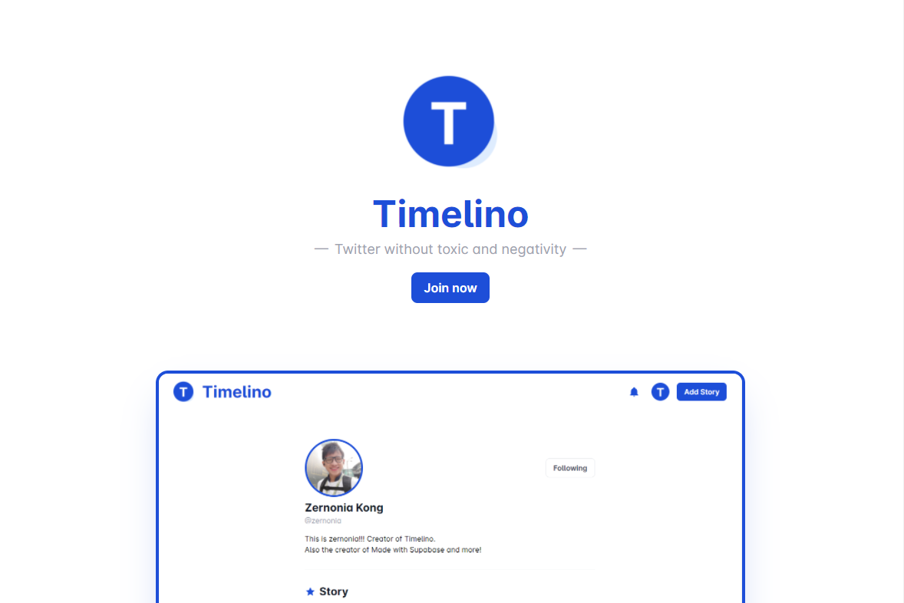
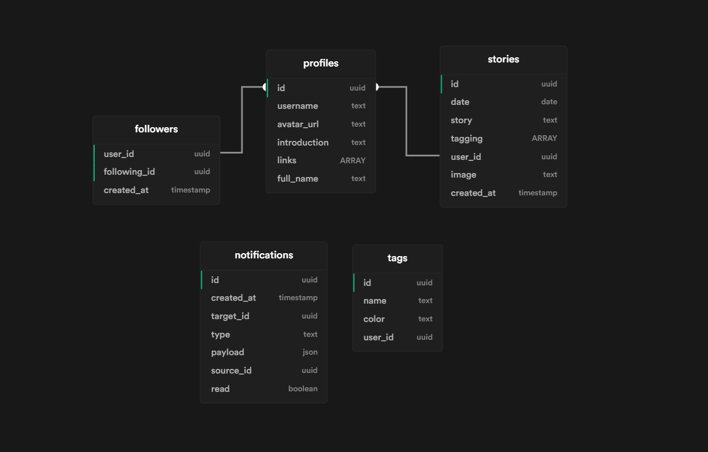

<!-- PROJECT LOGO -->
<br />
<p align="center">
  <a href="https://github.com/zernonia/timelino">
    
  </a>

  <h3 align="center">Timelino</h3>

  <p align="center">
    Twitter-liked platform without toxic and negativity
    <br />
    Open Source • Super Early MVP
    <br />
    <br />
    <a href="https://timelino.vercel.app/">View Demo</a>
    ·
    <a href="https://github.com/zernonia/timelino/issues">Report Bug</a>
    ·
    <a href="https://github.com/zernonia/timelino/issues">Request Feature</a>
  </p>
</p>



## 🚀 Features

- 🔨 Showcase your creation, idea, or life style
- 🚪 Simple login (Google, email)
- 👀 No comment system (No hate/negativity)
- 🤚 Editable timeline
- 🆓 Ads-free

## 📇 About The Project

**Twitter without toxic and negativity**

The main purpose of this idea is to create a **toxic-free** and **negativity-free** platform for users to share their latest creation or idea. This is actually to solve my own craving for a platform like this.

### Scope

This project turns out to be quite a challenge for me, as I'm currently still having a full-time job, and the complexity of the relational database is not my forte yet. But I somehow managed to say this is the **MVP** for this project.

### Inspiration

I saw a few post on Twitter where the user decided to leave the platform because of the negativity, and all the hates.
Furthermore, [Polywork](https://www.polywork.com/) inspired me to create a platform for those user. I didn't enjoy Polywork because of its super high complexity for someone who just wanted to post a simple story on my timeline. Thus, I look this liberty, and challenge to create this platform.

### 🔨 Built With

- [Vue 3](https://v3.vuejs.org/)
- [Vite](https://vitejs.dev/)
- [WindiCSS](https://windicss.org/)
- [Supabase](https://supabase.io)

## ⚡ Supabase

- Supabase Auth
- Supabase Database
- Supabase Storage
- Supabase Realtime (for Notications)

### Database Schema



<p align = "center">
Schema generated by <a href="https://supabase-schema.vercel.app/">Supabase Schema</a>
</p>

### Custom SQL

Most of the tables was generated using Supabase Dashboard, but altered using custom script. Unfortunately, I forgot to save those script. But the SQL functions and triggers are listed below.

1 - Handle New User (Function & Trigger)

```sql
/**
* This trigger automatically creates a user entry when a new user signs up via Supabase Auth.
*/
create or replace function public.handle_new_user()
returns trigger as $$
begin
  insert into public.profiles (id, avatar_url, full_name)
  values (new.id, new.raw_user_meta_data->>'avatar_url', new.raw_user_meta_data->>'full_name');
  return new;
end;
$$ language plpgsql security definer;

create trigger on_auth_user_created
  after insert on auth.users
  for each row execute procedure public.handle_new_user();
```

2 - Handle New Follower (Function & Trigger) (WIP)

```sql
/**
* This trigger automatically creates a nofication entry when a user follow other user.
*/
create or replace function public.handle_new_follower()
returns trigger as $$
begin
  insert into public.notifications (target_id, type, payload, source_id)
  values (
    new.following_id,
    'follow',
    (select row_to_json(c) from (select b.username, b.avatar_url from followers a left join profiles b on a.user_id = b.id where a.user_id = new.user_id limit 1) c),
    new.user_id
  );
  return new;
end;
$$ language plpgsql security definer;
```

3 - Get User's Story (Function)

```sql
/**
* This function populate the story with tagging details.
*/
create or replace function get_stories (user_name text)
  returns table (id uuid, date date, story text, tagging uuid[], user_id uuid, image text, created_at timestamp, tags json)
  language plpgsql
  as
  $$
    begin
    return query
      select a.*, json_agg(b) as tags from stories a left join tags b on b.id = any(a.tagging) where a.user_id = (select c.id from profiles c where c.username = user_name) group by a.id;
    end;
  $$
```

4 - Get User's Story (Function)

```sql
/**
* This function populate the story with filtered tagging details.
*/
create or replace function get_tagged_stories (user_name text, tag_id uuid)
  returns table (id uuid, date date, story text, tagging uuid[], user_id uuid, image text, created_at timestamp, tags json)
  language plpgsql
  as
  $$
    begin
    return query
      select a.*, json_agg(b) as tags from stories a left join tags b on b.id = any(a.tagging) where a.user_id = (select c.id from profiles c where c.username = user_name) and b.id = tag_id group by a.id;
    end;
  $$
```

5- Get Story of the user you follow (Function)

```sql
/**
* This function returns the stories of the users you are following. Used in '/home'.
*/
create or replace function get_following_stories ()
  returns table (id uuid, date date, story text, tagging uuid[], user_id uuid, image text, created_at timestamp, tags json, user_data json)
  language plpgsql
  as
  $$
    begin
    return query
      select d.*, row_to_json(e) as user_data from profiles e right join
      (select a.*, json_agg(b) as tags
        from stories a
        left join tags b
        on b.id = any(a.tagging)
        where a.user_id in (select c.following_id from followers c where c.user_id = auth.uid())
        group by a.id
        order by created_at desc
      ) d
      on e.id = d.user_id
        ;
    end;
  $$
```

6 - Get Suggested User (Function) (WIP)

```sql
/**
* This function returns profiles that you should follow. WIP
*/
create or replace function get_suggested_user()
  returns setof profiles
  language plpgsql
  as
  $$
    begin
    return query
      select * from profiles where id <> auth.uid() order by random();
    end;
  $$
```

## ➕ Contributing

If you like this project, and see potential in it, feel free to reach out to me at Twitter ([@zernonia](https://twitter.com/zernonia)) or `zernonia@gmail.com`

## 📜 License

Not Associated with Supabase.

Distributed under the MIT License. See `LICENSE` for more information.

# 📧 Contact

Zernonia - [@zernonia](https://twitter.com/zernonia) - zernonia@gmail.com

Also, if you like my work, please buy me a coffee ☕😳

<a href="https://www.buymeacoffee.com/zernonia" target="_blank">
    
  </a>
